## Introduction

Coming from high-level vulnerability research, I felt i had a lot of gaps in low-level in general.\
A friend of mine created its own mini kernel in bare metal and I found it very fun to do so I started mine on a Raspberry Pi 3B+.

I thought I knew UART well. Then I opened the usual init code and understood maybe 10% of it, and I definitely couldn't have written it myself.

So this article rebuilds the **BCM2837**'s (RPI 3B+ Soc) mini UART from the datasheet, and shows where each value comes from and how I found it. Big datasheets are hard to navigate, and that part is what I was missing the most.

This article has been inspired by [sypstraw’s guide](https://rpi4os.com/).\
All the files used can be found in the **`mini-uart/`** folder of my Mini Kernel Repository: [Octopuss78/PoulpOS](https://github.com/Octopuss78/PoulpOS/tree/main/mini-uart)

## UART Basics

### UART in 2 minutes

The Universal Asynchronous Receiver/Transmitter (UART) is one of the simplest ways to talk to an embedded device and still the go-to debug port on almost every board.

The principle is very simple: Each side has three pins: TX to send data, RX to receive it, and GND.

### Wiring and settings

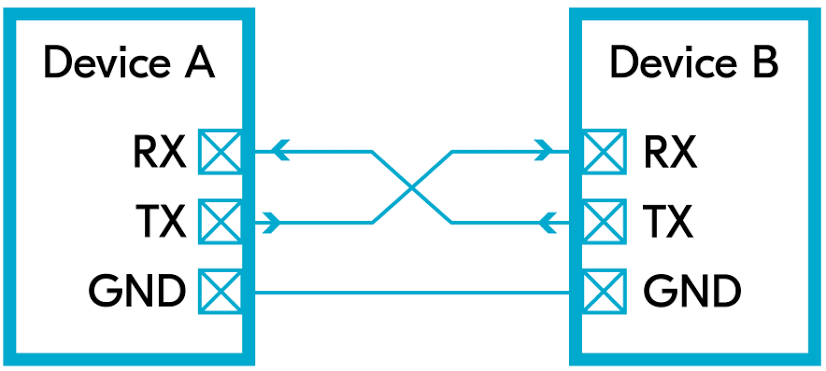

The wiring is crossed: the TX of one device goes to the RX of the other, and vice versa.\
The two GND pins are tied together so both sides share the same voltage reference.

UART is asynchronous, which means it doesn’t carry its own clock.\
Therefore, both parties communicating must agree on a common clock speed before sending any data, by choosing the baud rate, the number of bits sent per second.

They must also agree on the frame format:

- **Data bits**: usually 8
- **Parity**: an optional error-detection bit — N (none), E (even) or O (odd)
- **Stop bits**: how long the line stays high after the data, usually 1 bit period

Note that none of this is negotiated over the wire, each side must be configured manually beforehand. That's UART's best feature, since a chip can talk as soon as a few registers are written, with no driver or stack. It's also its worst: a mismatch gives you garbage, never an error.

### Communication

The default state of TX is high (logical 1) for IDLE.

Here is the process for sending a byte:

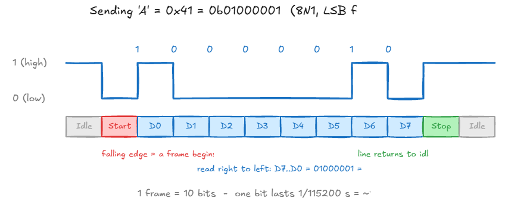

1. **Start bit**: the line drops to 0, telling the receiver a frame begins.
2. **Data**: the 8 bits, least significant bit first.
3. **Stop bit**: the line goes back to 1.

The receiver never detects the end of a frame, it counts: after the start bit, it samples the line once per bit period, eight times, which is exactly why a wrong baud rate produces garbage instead of an error.

Therefore, the stop bit is not an end marker, it simply returns the line to idle.

### UART vs Mini UART

The BCM2837 has two UARTs: a full ARM PL011, and a stripped-down "mini UART" living in an auxiliary block. On the Pi 3, the PL011 is wired to the Bluetooth chip by default, so the pins on the header go to the mini UART.

It buffers bytes in two small 8-byte FIFOs, one per direction. And its baud rate is derived from the VideoCore's core clock, which will come back to annoy us later.\
Here is a detailed list of the main differences:

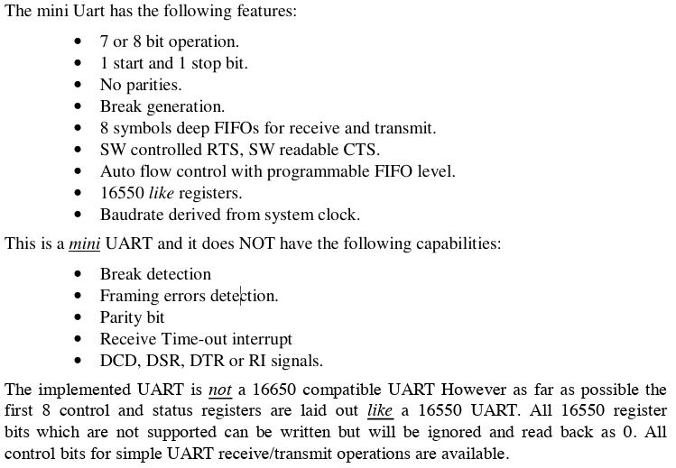

We will be using the **`115200/8N1`** standard for our Mini UART: 115200 baud, 8 data bits, no parity, 1 stop bit.

The mini UART is deliberately minimal: 8N1 is not really a choice, since it only supports one stop bit and no parity, and it detects no errors at all.

## Finding the addresses

Let's start with the GPIO controller's registers, which show the whole method:

```c
enum {
    PERIPHERAL_BASE_ADDR = 0x3F000000,
    GPFSEL0         = PERIPHERAL_BASE_ADDR + 0x200000,
    GPPUD           = PERIPHERAL_BASE_ADDR + 0x200094,
    GPPUDCLK0       = PERIPHERAL_BASE_ADDR + 0x200098
};
```

The datasheet lists every register at an address starting with `0x7E`. Those are bus addresses, seen from the VideoCore. The ARM sees the same peripherals at `0x3F…` .\
So `GPFSEL0`, listed at `0x7E200000`, is `0x3F200000` for us.

The MMU is off, so these are the addresses the CPU uses directly.

## MMIO

Addresses in hand, we still need a way to read and write their values.\
On the BCM2837, that is done through a mechanism called ***Memory-Mapped I/O* (MMIO)**.

A CPU reaches the outside world the same way it reaches RAM: by putting an address on the bus. So instead of a special instruction per peripheral, the SoC gives each peripheral a range of addresses. That's **MMIO**: peripheral registers are driven with ordinary loads and stores.

Writing to **`0x3F215040` (`AUX_MU_IO_REG`)** sends a byte to the mini UART and the CPU never knows the difference.\
The bus looks at the address and routes the access to the UART instead of RAM, as there is no RAM there at all.

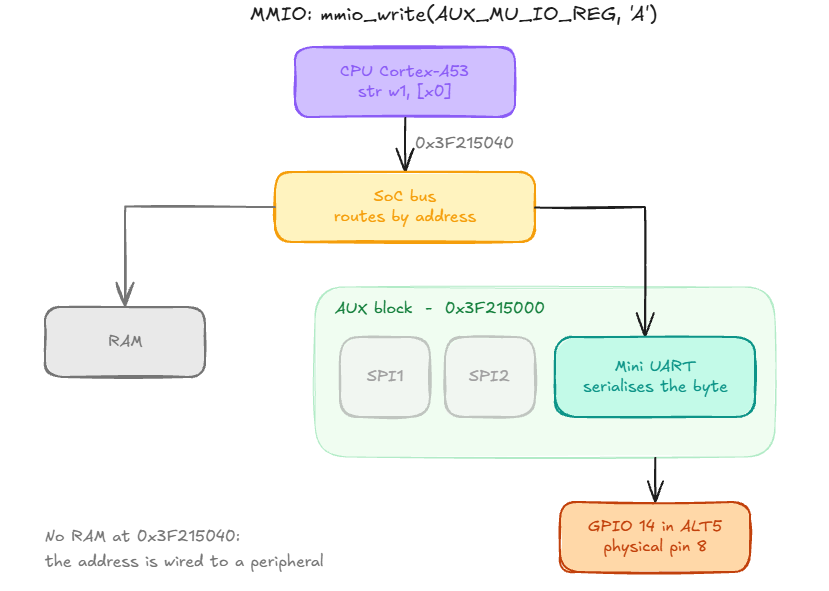

```c
void mmio_write(unsigned long addr, unsigned int val)
{
  *(volatile unsigned int *)addr = val;
}

unsigned int mmio_read(unsigned long addr)
{
  return *(volatile unsigned int *) addr;
}

```

These two functions are the only ones touching hardware in our code, and as you can see they are pretty easy :)

The keyword that matters is `volatile` which it tells the compiler that every access it must not cache, merge or drop reads and writes.\
Without it, the compiler could read the UART status once and reuse the result for another use case for example.

## GPIO

Our building blocks are ready. Let's put them to work on the GPIO first, because nothing leaves the chip until both pins are wired to the UART !

### ALT5

Our SoCs can have a lot of peripherals (UART, SPI, I2C, …), but only have a limited number of pins.\
That is why it uses multiplexing: each pin is connected to multiple devices.\
Each one can be wired to several peripherals, and a switch picks which one drives it\
The registers responsible for this are **`GPFSEL(0-5)`**.

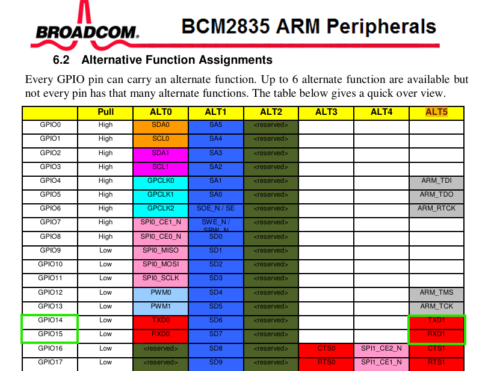

Our Mini UART uses ALT5 so as we need to interact with TXD1 and RXD1, we will be using pins 14 and 15.\
Pin 14 will be used to send data and Pin 15 to receive data.

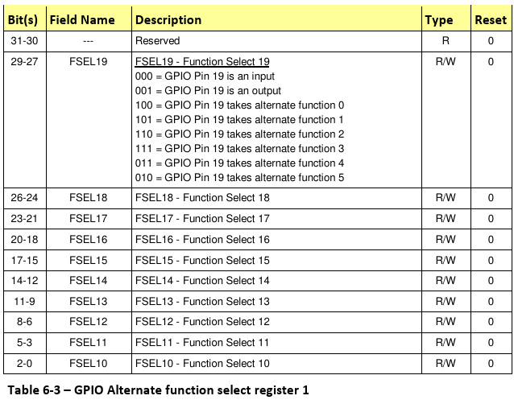

We can guess two things thanks to the documentation:\
The first is that the size for each field is 3 bits, as each **`FSEL`** covers 3 bits and 9 modes.\
The second is that each **`GPFSEL`** covers 10 pins (10 FSEL per table).

Therefore, as we are going to use **`GPFSEL1`** for both pin 14 and 15, and **`FSEL14/15`** with **`010`** to select ALT5.

Our goal is to therefore to set bits **`12-14`** to **`010`** without touching the 29 others.\
We will have to do some arithmetics here !

Let’s take the value for our **`GPFSEL1`** value:

```c
FSEL :          19  18  17  16  15  14  13  12  11  10
                                     ↓
val :           010 110 111 110 011 011 001 010 101 110

1. Mask         000 000 000 000 000 111 000 000 000 000    7 << 12
2. Invert       111 111 111 111 111 000 111 111 111 111    ~(7 << 12)
3. AND          010 110 111 110 011 000 001 010 101 110    val & ~(7 << 12)
4. Value        000 000 000 000 000 010 000 000 000 000    2 << 12
5. OR           010 110 111 110 011 010 001 010 101 110    val | (2 << 12)
```

Here’s our final calculation chain:

```c
void gpio_set_alt5(unsigned int pin)
{
  unsigned int reg = GPFSEL0 + (pin/10)*4;
  unsigned int shift = (pin % 10) *3;
  unsigned int val = mmio_read(reg);
  val = val & ~(7 << shift);
  val = val | (GPIO_FUNCTION_ALT5 << shift);
  mmio_write(reg,val);
}
```

This step is not optional: until the switch is flipped, the UART can be configured perfectly and still send its bits nowhere, because they never reach the physical pin.

### Pull

One thing we still haven’t dealt with are the pull resistors.

A pin configured as an **input** and left unconnected has no defined state: its voltage floats with ambient electromagnetic interference, so reading it returns random values. The solution is small internal resistors that pull the pin to a known level, towards 3.3V for a 1, or GND for a 0.

GPIO Pull-up/down Register (**`GPPUD`**) is simple: only its two lowest bits matter.\
We have three states:

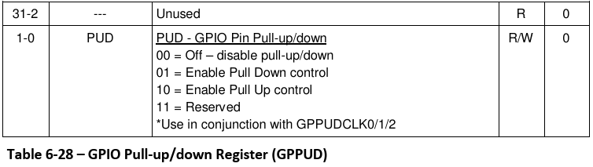

```c
enum {
    PULL_NONE = 0,
    PULL_DOWN = 1,
    PULL_UP   = 2
};
```

Our `PULL_*` enum mirrors these values.\
The key detail is the note at the bottom: *"Use in conjunction with GPPUDCLK0/1/2"*.\
Indeed **`GPPUD`** tells **what** to do and **`GPPUDCLK0`** tells **who** does it.

The datasheet gives the sequence to apply it:

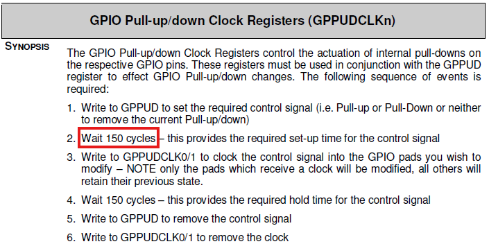

Notice the "wait 150 cycles".\
C has no notion of a cycle, so we cannot write that directly. And the datasheet does not say whether 150 is a minimum or an exact value.

This is where I got stuck for a while.

Searching GitHub for `GPPUD "150 cycles"` led me to this library, which drives the same chip: [janne/bcm2835](https://github.com/janne/bcm2835/blob/master/bcm2835.c)

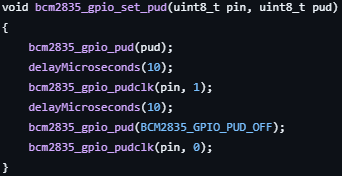

As we can see it waits for 10 µs between each step.\
At a 250 MHz system clock, that is 2500 cycles. Far more than 150 !\
Makes sense: the datasheet calls these waits set-up and hold times, which are minimum durations by nature. Waiting longer is fine.

Let’s try to be more precise though and settle around 150 cycles by calculating the right time to wait.

```c
150 / 250 000 000 = 0.6 µs
```

So we need to wait at least 0.6 µs.\
To measure that, the BCM2837 has a System Timer whose `CLO` register counts up by one every microsecond. The datasheet lists it at `0x7E003004`, so `0x3F003004` for us:

```c
enum {
    SYSTMR_CLO = PERIPHERAL_BASE_ADDR + 0x3004
};
```

We read the counter once, then keep reading until it has moved forward enough.

```c
void delay_us(unsigned int us)
{
    unsigned int start = mmio_read(SYSTMR_CLO);
    while (mmio_read(SYSTMR_CLO) - start < us);
}
```

The counter only counts whole microseconds, so we cannot wait exactly 0.6 µs. And one tick is not enough: if the counter was about to tick when we started, we would barely wait at all.\
So we call `delay_us(2)`, which guarantees at least a full microsecond.

There is actually a difference here for the Raspberry Pi 4 this whole dance is gone: a single register, **`GPPUPPDN0`**, holds a readable 2-bit field per pin, so setting a pull is one write instead of a six-step sequence with timing constraints.

Unlike **`GPFSEL`**, we write **`GPPUDCLK0`** directly without reading it first:

```c
// Write No Pull to GPPUD
mmio_write(GPPUD,PULL_NONE);
delay_us(2);

//Set pin 14 and 15 in GPPUDCLK0
mmio_write(GPPUDCLK0, (1 << 14) | (1 << 15));
delay_us(2);
```

Now that the values are stored in pins 14 and 15, we need to clean everything and set back both registers:

```c
//Clean both registers
mmio_write(GPPUD, PULL_NONE);
mmio_write(GPPUDCLK0, 0);
```

You may be wondering why do we set them back to 0 if the goal of the function is to set them to 1 ?\
`GPPUDCLK0` does not hold the pull state: it is a trigger.\
Therefore setting it to 1 for a few microseconds sends the information to our SoC to disable pull but once the cycle is done, we can set it back to zero without it to change the state back.

## UART

The most complex part is done: our 2 pins lead straight to our mini UART.\
Now the final part is to use these GPIO functions in the right order to set up and orchestrate our UART.

The mini UART has its own set of registers, all packed in one auxiliary block:

```c
enum {
    AUX_BASE        = PERIPHERAL_BASE_ADDR + 0x215000,
    AUX_ENABLES     = AUX_BASE + 4,
    AUX_MU_IO_REG   = AUX_BASE + 64,
    AUX_MU_IER_REG  = AUX_BASE + 68,
    AUX_MU_IIR_REG  = AUX_BASE + 72,
    AUX_MU_LCR_REG  = AUX_BASE + 76,
    AUX_MU_MCR_REG  = AUX_BASE + 80,
    AUX_MU_LSR_REG  = AUX_BASE + 84,
    AUX_MU_CNTL_REG = AUX_BASE + 96,
    AUX_MU_BAUD_REG = AUX_BASE + 104,
    AUX_UART_CLOCK = 250000000,
    UART_BAUD_RATE      = 115200,
    AUX_MU_BAUD_VAL = (AUX_UART_CLOCK / (UART_BAUD_RATE * 8)) - 1
};
```

`AUX_BASE` points to the start of the auxiliary peripheral block, which the BCM2837 shares between the mini UART and two SPI masters, hence the **`AUX_`** prefix on everything.\
Everything else is an offset inside it, and they fall into three groups.

- **Gatekeeping**: **`AUX_ENABLES`** is the master switch for the whole block, until its bit is set, the other registers cannot be read or written.
- **Setup:**
    - **`AUX_MU_LCR_REG`** : frame format
    - **`AUX_MU_BAUD_REG`** : speed
    - **`AUX_MU_CNTL_REG`**: switches TX and RX on
    - **`AUX_MU_IER_REG`**:  enables interrupts
    - **`AUX_MU_IIR_REG`**: identifies the interrupt + allows to clear our I/O FIFOs
    - **`AUX_MU_MCR_REG`**: hardware flow control (RTS line)

The last 3 registers will be turned off as we use polling instead of interruptions.

- **Traffic**:
    - **`AUX_MU_LSR_REG`**: tells us whether the transmitter is free or a byte has arrived
    - **`AUX_MU_IO_REG`**: where bytes actually go in and out.
- **`AUX_UART_CLOCK` :** It's the VideoCore's core clock, which the firmware may scale at runtime and drag our baud rate with it. That's why we pin it at 250 MHz in **`config.txt`** later.

The mini UART divides down to produce the baud rate, found with the following:

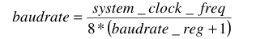

The 8 comes from the mini UART sampling each bit eight times.\
Our formula for the register:

```c
AUX_MU_BAUD_VAL = (AUX_UART_CLOCK / (UART_BAUD_RATE * 8)) - 1
```

At 250 MHz targeting 115200 baud, that gives us around 270.

Note:\
A wrong peripheral base address gives you silence as the writes land nowhere at all.\
A wrong clock gives you garbage characters, because the UART works perfectly and only the timing is off.\
Knowing which of the two you are looking at tells you immediately where to start debugging.

### Init

To begin, we need a startup routine. It is mostly a list of many register writes.\
Each register was introduced above, so the comments speak for themselves:

```c
void uart_init(void)
{
  //Select GPIO ALT5 Function 
  gpio_set_alt5(14);
  gpio_set_alt5(15);

  //Disable Pull Resistors
  disable_pull();

  //Enable Mini UART Auxiliaries
  mmio_write(AUX_ENABLES, 1);
    
  //set TX and RX down for init
  mmio_write(AUX_MU_CNTL_REG, 0);

  //Set data format to 8 bit-mode
  mmio_write(AUX_MU_LCR_REG, 3);

  //Setting Baud rate
  mmio_write(AUX_MU_BAUD_REG, AUX_MU_BAUD_VAL);

  //Making sure IER and MCR are set to zero
  mmio_write(AUX_MU_MCR_REG, 0);
  mmio_write(AUX_MU_IER_REG, 0);

  //Clearing receive and transmit FIFOs
  mmio_write(AUX_MU_IIR_REG, 2 | 4);

  //Enable TX and RX
  mmio_write(AUX_MU_CNTL_REG, 3);
  
}
```

What the code does not show is why the order matters:

- **GPIO first:** The datasheet asks for the pins to be routed before the UART is enabled.\
Otherwise, the RX line reads low, which the mini UART reads as an endless stream of start bits and **`0x00`** bytes.
- **`AUX_ENABLES`:**  Essential as all mini UART registers cannot be written without it
- **`CNTL`:** We switch TX and RX off before touching the configuration, and back on only once everything is set.

A good habit worth mentioning: set every register you rely on, even when you expect it to already hold the right value.\
Other code runs before ours at boot: the firmware may have touched the UART, so we never assume a register's state. That is why **`IER`** and **`MCR`** are explicitly cleared.

Note: you'll see **`0xC6`** written to **`IIR`** in many tutorials; bits 7:6 are read-only, so **`6`** still works and is easier.

### Sending data

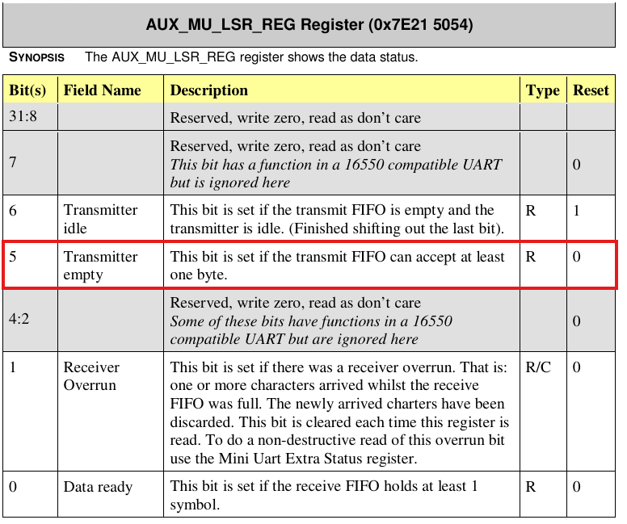

The first line is the whole idea of **polling**: we keep reading **`LSR`** until bit 5 says the transmit FIFO has room for at least one byte.

We can use a **`&`** mask to isolate that single bit (detailed it in ALT5 section), and the loop spins as long as it is 0.\
Only then, we can write our byte to **`IO_REG`**, and the mini UART shifts on the wire.\
We can now write our function in order to write each character of the string one by one:

```c
void uart_putc(char c)
{
  //Waiting for FIFO to accept at least 1 byte
  while (!(mmio_read(AUX_MU_LSR_REG) & (1 << 5)));

  //Write char
  mmio_write(AUX_MU_IO_REG, c);
}
```

```c
void uart_puts(const char *s)
{
  int i = 0;
  while(s[i])
  {
    if(s[i]=='\n')
      uart_putc('\r');
    uart_putc(s[i]);
    i++;
  }
}
```

Good old puts function, been repeating it so much when learning to code i’ve been dreaming of it some nights ! Maybe not the only one :))

Note: Terminals expect **`\r\n`**: a bare **`\n`** moves down without going back to column 0, so we add the **`\r`** ourselves.

## Linking it all together

### Boot code

Before **`main()`** can run, a few lines of assembly are needed to prepare the ground.\
We won’t dive into it but **`boot.S`** does three main things:

1. Set up a stack, as C needs one for its first function call
2. Zero sections such as **`.bss`**, C expects them to be filled with zero for global variables
3. Call **`main()`**

### C Files

Then it’s time to create our main:

```c
#include "io.h"

void main(void)
{
  uart_init();
  uart_puts("Hello world\n");
  while(1);
}
```

Note the infinite loop at the end: there is no operating system to return to. If **`main()`** returned, execution would fall back into **`boot.S`**, and whatever sits in memory after the call would run next. A kernel never exits: it is the last link in the boot chain.

The linker script places **`boot.S`** first, at **`0x80000`**, which is where the firmware jumps to our **`kernel8.img`**.  Then we have the Makefile to automate the build.\
Both files were borrowed from sypstraw’s [**rpi4os project**](https://github.com/sypstraw/rpi4-osdev).

## Build and Run

### QEMU

If you want to run it with QEMU, make sure that you have **`qemu-system-aarch64`** and the **`aarch64-linux-gnu-gcc`** cross-compiler.\
Then you simply need to clone the repository, build it with make and run the following command:

```bash
qemu-system-aarch64 -M raspi3b -kernel build/kernel8.img -serial null -serial stdio -display none
```

Note that the `-serial null -serial stdio` pair matters as QEMU maps its first serial port to the PL011 and the second one to the mini UART. We discard the first and plug the second into our terminal.

However, keep in mind that QEMU is great to check the logic, but it does not validate everything.\
It has no real pins, so a wrong GPIO setup goes unnoticed.\
It also forwards bytes without real timing, so a wrong baud rate does not show up either.\
Only the real board tests those !

### Raspberry Pi 3B+

First, make sure your pins are plugged from your FT232 controller as follows:

- FT232 TXD → Pin 10 (RXD)
- FT232 RXD → Pin 8 (TXD)
- GND → Pin 6

The Pi's boot ROM looks for a FAT32 partition.\
On it, we need the files that are provided inside the folder **`firmware/`**:

- **bootcode.bin**: Second Stage bootloader, starts SDRAM and loads **`start.elf`**
- **config.txt**: Kernel settings used by **`start.elf`**
- **fixup.dat**: Sets up the memory split between the GPU and the ARM. used by **`start.elf`**
- **start.elf**: VideoCore firmware, loads **`kernel8.img`** into RAM

Build the kernel first with **`make`**, which drops it in **`build/kernel8.img`**.\
Then find your SD card's boot partition (the **`vfat`** one, usually **`/dev/mmcblk0p1`** or **`/dev/sdX1`**):

```bash
lsblk -f
```

Mount it, clear it and copy everything:

```bash
sudo mkdir -p /mnt/sd
sudo mount /dev/mmcblk0p1 /mnt/sd
sudo rm -rf /mnt/sd/*
sudo cp firmware/* build/kernel8.img /mnt/sd/
```

Then flush and unmount before pulling the card out:

```bash
sync
sudo umount /mnt/sd
```

Now it's time to test it in real conditions!\
Insert the SD card in the Pi.

Before plugging the power supply of your Pi, launch a UART session on your machine:

```bash
picocom -b 115200 /dev/ttyUSB0
```

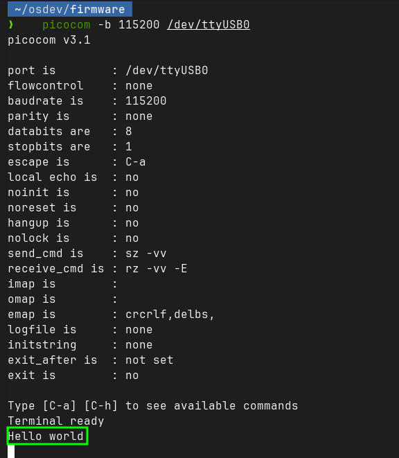

Let’s goooo !\
This is the longest “Hello World” I've ever written :))

## Wrapping up

This was my first blogpost and project of OS development.\
I hope you learned things on the road and that it made you want to dive into Bare Metal programming !
